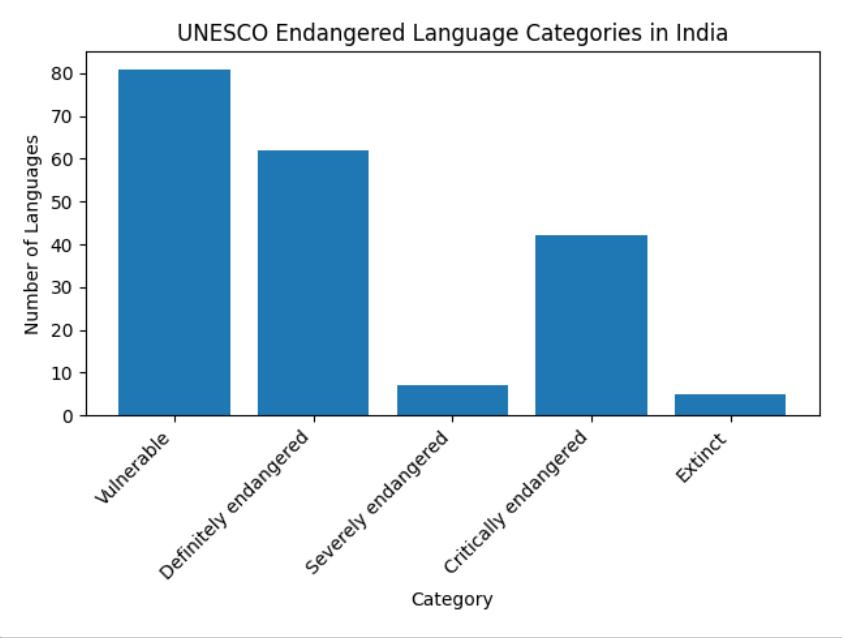
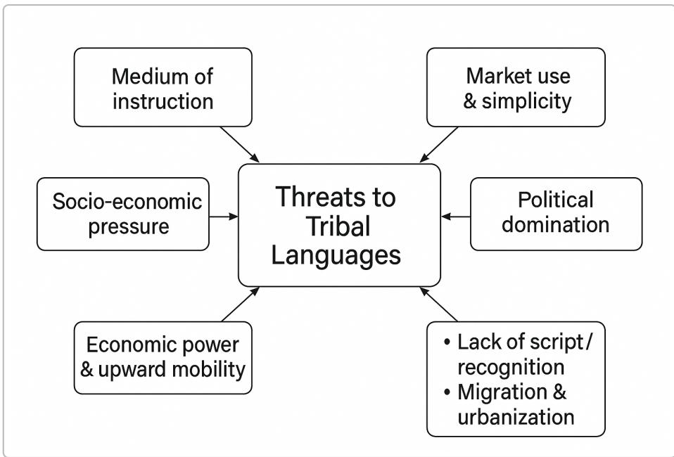

# Threats to Tribal Languages in India

# Introduction

India is one of the most linguistically diverse countries in the world. The People’s Linguistic Survey of India (PLSI 2013) recorded 780 languages and 86 scripts, yet many of these are spoken by tiny populations and are not officially recognised. UNESCO’s Atlas of the World’s Languages in Danger lists 197 Indian languages in various stages of endangerment: 81 vulnerable, 62 definitely endangered, 7 severely endangered, 42 critically endangered and 5 already extinct . Over the last five decades1 India has lost roughly 250 languages ; linguist G.N.   Devy warns that about 400 more could1 disappear in the near future $^ 2$ . The vast majority of endangered tongues are tribal. Because tribal communities form only about $8 . 6 \%$ of India’s population, their languages are often invisible in national policies and census operations that only list languages spoken by more than 10 000 people . This3 note summarises the reasons why tribal languages are threatened, the consequences of their decline, government efforts to conserve them, and recommendations for revitalisation.

# Visualising endangerment levels

The bar chart below summarises UNESCO’s categories of endangered languages in India, showing that a large number fall into the “vulnerable” and “definitely endangered” categories but many have reached the critical stage or become extinct.

# Reasons for the decline of tribal languages

# Dominant languages in education

Indian schools often use state or national languages (Hindi, English, Odia, etc.) as the medium of instruction, leaving tribal children unable to understand classroom content. In Odisha, for example,

tribal students are taught in Odia, which is not their mother tongue; textbooks contain contexts unfamiliar to them, leading to poor comprehension and early drop‑out rates . Nationwide, schooling4 in dominant languages encourages children to adopt these languages and abandon their own.

# Socio‑economic pressure and upward mobility

Many tribal parents believe that speaking a dominant language opens doors to jobs and social mobility. A study on north‑eastern languages notes that better economic prospects incentivise shifts to larger languages . Ajit   Mohanty calls this phenomenon “linguicide”—a process in which5 subordinate languages withdraw into the home while major languages occupy domains of education, trade and power . The example of Kond women in Odisha illustrates this: their Kui language was 6 pushed out of markets, depriving them of bargaining power and forcing them to use Odia $^ 7$ .

# Market use and simplicity

G.N. Devy argues that languages with greater market use and simpler syntactic structures are preferred for communication. Languages used in trading centres and government offices have higher economic value, prompting speakers of smaller languages to shift towards them .8

# Political domination and lack of official recognition

Dominant languages enjoy state patronage through official status (e.g., in the Eighth Schedule) and media coverage. Only a few tribal languages such as Bodo and Santali have secured this status after long political struggles , while hundreds of others remain unrecognised and therefore excluded from9 administration and education. Since 1971, the Census has dropped languages with fewer than 10 000 speakers from its list , rendering most tribal languages invisible.3

# Absence of written literature and literacy materials

Many tribal languages are oral. A north‑eastern study observes that languages without books, poetry or documented folklore struggle to maintain cultural significance and to be transmitted across generations . The absence of alphabets, dictionaries and teaching materials reinforces their10 marginalisation.

# Migration, urbanisation and intergenerational shift

Urban migration and intermarriage with speakers of dominant languages accelerate language shift. G.N. Devy notes that when a language dies its speakers first migrate to another language and then physically migrate to another region . Younger tribal people often adopt regional or national11 languages to fit into urban environments, leaving their mother tongues behind.

# Illustration of key threats

The following concept map summarises these interconnected threats:

# Consequences of language loss

# Cultural and knowledge erosion

Languages encapsulate unique worldviews, ecological knowledge, folklore and rituals. When a language disappears, a unique way of looking at the world vanishes . Tribal languages carry 11 indigenous knowledge about medicinal plants, agro‑practices, kinship and cosmology; their loss erodes this heritage. The People’s Linguistic Survey warns that India has already lost 220 languages since 1961 and may lose many more.2

# Social disintegration and migration

Language loss often precedes and accompanies migration, as speakers move to areas where dominant languages prevail . In the process they abandon traditional livelihoods and cultural practices, leading11 to disintegration of community networks and greater assimilation into mainstream society.

# Educational disadvantage

Children educated in unfamiliar languages face poor learning outcomes and high drop‑out rates. When mother tongues are ignored, students lose interest in schooling and become alienated from their culture . Monolingual curricula also undermine self‑esteem and identity formation.4

# Economic marginalisation

Exclusion of tribal languages from markets and administration deprives speakers of bargaining power. Mohanty notes that when languages like Kui are pushed out of local trade, women lose their economic agency and must transact in dominant tongues $^ 7$ . The marginalisation of languages is intertwined with poverty and lack of political voice $6$ .

# Cultural homogenisation

As tribal languages vanish, cultural practices such as festivals, songs and oral histories also fade. Communities assimilate into dominant cultures, leading to homogenisation and the loss of India’s plurilingual heritage.

# Government and community efforts to preserve tribal languages

# Scheme for Protection and Preservation of Endangered Languages (SPPEL)

The Government of India launched SPPEL in 2013 to document languages spoken by fewer than 10 000 people. The programme commissions linguistic institutions to prepare grammars, dictionaries and ethno‑linguistic profiles for each language . As of 2020, over 100 endangered languages have been12 identified and documentation work is ongoing.

# Multi‑lingual education (MLE) programmes

Several states have introduced Mother Tongue Based Multi‑Lingual Education. Odisha’s MLE programme teaches tribal children in their mother tongue during early grades and gradually introduces Odia and English; the state has appointed 3 385 tribal language teachers and published dictionaries for 20 tribal languages . However, the programme has faced challenges such as insufficient teacher 13 training and a translation‑only approach without developing original content .14

# Recognition under the Eighth Schedule

Through political mobilisation, Bodo (2003) and Santali (2003) were added to the Eighth Schedule, granting them official status 9 . Recognition provides access to schooling, media and administration and helps revitalise language use.

# Community‑driven initiatives

Grass‑roots movements have shown creative ways to revitalise languages. In Jharkhand, the Asur Mobile Radio broadcasts stories and songs in the endangered Asur language, raising pride among youth . Cultural festivals, community radio and digital archives (e.g., smartphone apps for Gondi and15 Ho) create new domains of use. Tribal youth are using social media to write poetry and produce music videos in their mother tongues.

# Recommendations

Institutional support and recognition: Establish national and state‑level committees to identify1. endangered tribal languages and grant them institutional backing. Amend the Census and Eighth Schedule criteria so that languages with small speaker populations are documented and recognised.

Mother‑tongue education: Expand MLE programmes beyond primary schools; develop2. curricula, textbooks and learning materials in tribal languages rather than merely translating existing content. Train teachers from within the community and provide scholarships to encourage literacy in mother tongues.

Documentation and publication: Prepare descriptive grammars, dictionaries and3. orthographies with community participation. For unwritten languages, adopt or design scripts and promote literacy campaigns. Digitise existing folk tales, songs and oral histories; integrate them into school curricula and community libraries.

Language in public domains: Encourage the use of tribal languages in governance, local4. courts, markets and media. Provide incentives to businesses that use indigenous languages in signage and communication. Radio and television programmes, podcasts and theatre in tribal languages can help normalise their use.

Economic empowerment: Link language preservation with livelihoods by promoting cultural5. tourism, handicrafts, traditional healing and environmental knowledge. Recognise intellectual property rights for tribal knowledge and ensure revenue flows back to language communities.

Cultural and entertainment programmes: Organise festivals, storytelling sessions, music and6. dance competitions in tribal languages. Support community radios (as in the Asur example) and digital platforms where young speakers can create and share content.

Monitoring and research: Conduct periodic surveys to track language vitality. Encourage7. universities and linguistic departments to undertake participatory research with tribal communities and disseminate findings in accessible formats.

# Contemporary relevance and the Yuelu Declaration

The UNESCO Yuelu Declaration (Changsha, 2018/2019) calls on governments worldwide to protect linguistic diversity and promote language transmission. It emphasises that languages are vectors of cultural heritage and sustainable development . In the context of rapid digitalisation,16 pandemic‑induced disruptions and climate change, preserving tribal languages is crucial for maintaining ecological knowledge and resilience. The National Education Policy (NEP   2020) also recognises the importance of mother‑tongue instruction and proposes creating digital repositories of endangered languages.

# Conclusion

Tribal languages embody the cultural memory, knowledge systems and identity of India’s indigenous peoples. Despite constitutional promises, socio‑economic pressures, education policies, political domination and lack of recognition have placed many of these languages on the brink of extinction. The loss of a language is more than a loss of words—it is a loss of a worldview and a way of relating to the environment. Government schemes such as SPPEL and MLE, along with community initiatives like Asur Mobile Radio, demonstrate that revitalisation is possible. A concerted effort involving recognition, education reform, documentation, and cultural and economic empowerment can ensure that India’s tribal languages not only survive but thrive in the 21st century.

Seven decades after independence, many tribal languages in India face extinction 2 3 13 14 15

# threat

https://www.downtoearth.org.in/governance/seven-decades-after-independence-many-tribal-languages-in-india-faceextinction-threat-73071

multilingual-education-mle-for-tribal-children-of-odisha.pdf

https://repository.education.gov.in/wp-content/uploads/2017/07/multilingual-education-mle-for-tribal-children-of-odisha.pdf

5 2-Sunipa-Ghosh-Dastidar-Dr.-Rajesh-Kumar-Saha.pdf10 https://tssreview.in/wp-content/uploads/2025/09/2-Sunipa-Ghosh-Dastidar-Dr.-Rajesh-Kumar-Saha.pdf

6 7 Languages, inequality and marginalization: implications of the double divide in Indian 9   
multilingualism   
https://ajitmohanty.org/docs/2/5.pdf

Coronavirus: India’s unplanned lockdown unleashed fresh hell for its Adivasis11 https://scroll.in/article/981519/coronavirus-indias-unplanned-lockdown-unleashed-fresh-hell-for-its-adivasis

(PDF) Strategies for Language Diversity Conservation from the Perspective of Transitivity: A Case Study of16 Yuelu Declaration

https://www.researchgate.net/publication/ 388339947_Strategies_for_Language_Diversity_Conservation_from_the_Perspective_of_Transitivity_A_Case_Study_of_Yuelu_Declaration